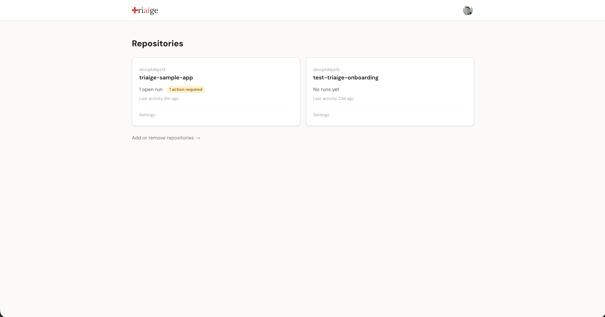
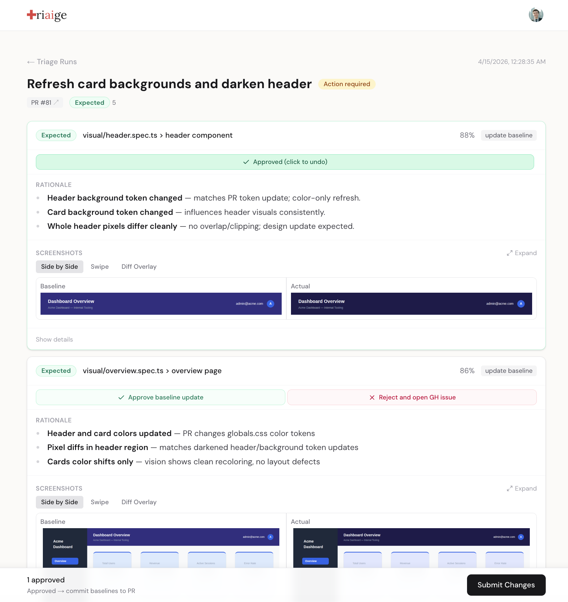
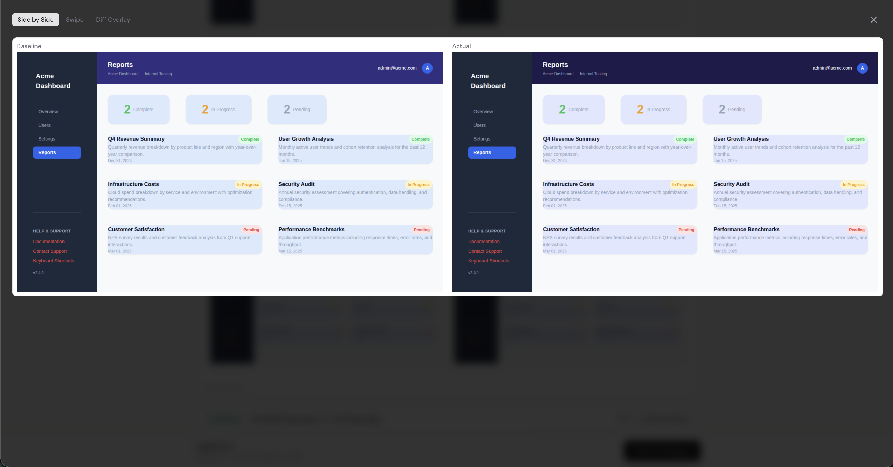
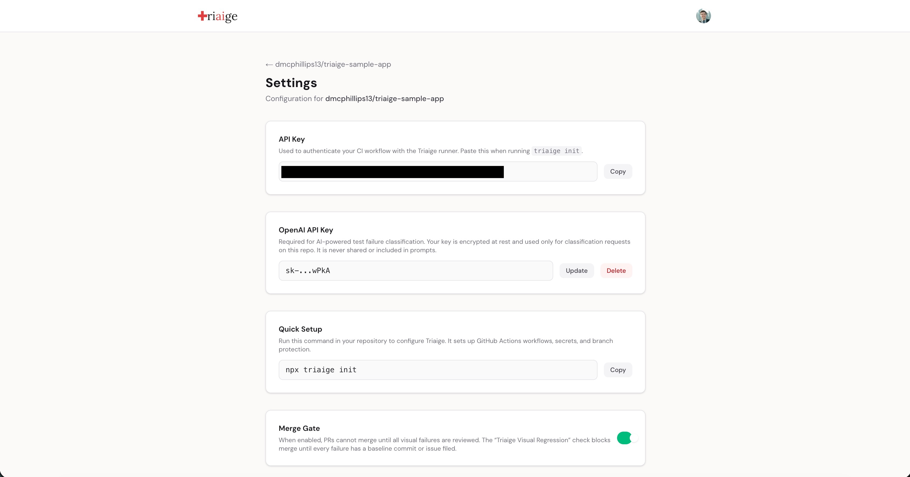
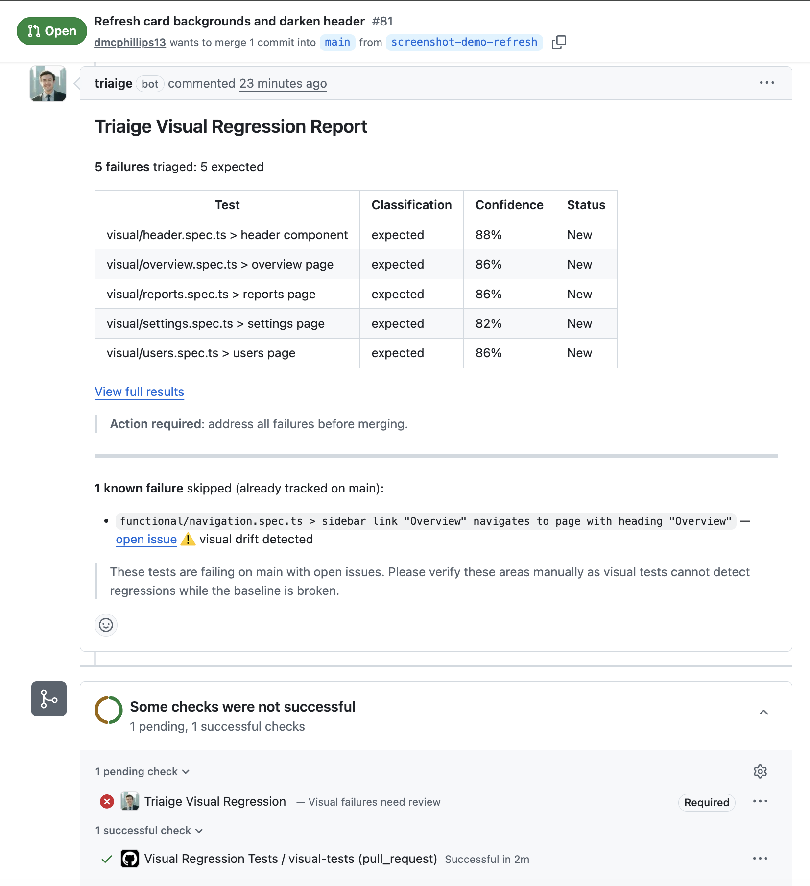

# Triaige

AI-powered triage for CI test failures. Triaige reads the code diff and PR description, classifies each Playwright failure as expected or unexpected, and surfaces only what needs human attention. Developers focus on what actually matters.

**Live app:** [triaige-dashboard.vercel.app](https://triaige-dashboard.vercel.app/)

---

## The Product

### Connected repositories with live status

Each repo shows open runs, action-required counts, and last activity at a glance.



### Review failures with full context

Failure cards show the AI classification, confidence score, and grounded rationale. Approve expected changes to commit updated baselines, or reject to open a tracking issue. The merge gate blocks until every failure is addressed.



### Compare screenshots side by side

Three comparison modes (side by side, swipe, and diff overlay) let reviewers verify exactly what changed.



### Configure each repo independently

Per-repo API keys, encrypted BYOK OpenAI key storage, one-command setup, and a merge gate toggle that controls whether PRs are blocked until review is complete.



### CI integration lives in your existing workflow

Triaige posts a classification report directly on the PR and blocks merge via a GitHub check until all failures are reviewed.



---

## How It Works

1. A PR triggers Playwright tests via GitHub Actions
2. Test failures are sent to the Triaige runner, which classifies each as **expected**, **unexpected**, or **uncertain** using the code diff, PR description, and episodic memory from past decisions
3. Results appear in the review dashboard with screenshots, rationale, and action buttons
4. A developer approves or rejects each failure. Approved baselines are committed to the PR branch; rejected failures become GitHub issues on merge
5. The merge gate passes once every failure is addressed
6. Human verdicts feed back as episodic memory, improving classification accuracy over time

## Architecture

```
PR opened
  -> GitHub Actions runs Playwright tests
  -> Failures POST to Triaige runner (FastAPI)
  -> Agentic RAG pipeline classifies each failure
  -> Results appear in dashboard (Next.js)
  -> Developer reviews, approves/rejects
  -> Baselines committed via Git Data API / issues filed
  -> Merge gate updates via GitHub Checks API
```

### Stack

- **Runner:** FastAPI, LangGraph, GPT-5.4-nano (text), GPT-4o (vision), Qdrant Cloud (episodic memory)
- **Dashboard:** Next.js App Router, React, Tailwind CSS
- **Database:** Neon Postgres with pgcrypto (encrypted BYOK key storage)
- **Deploy:** Render (runner) + Vercel (dashboard)
- **CI Integration:** GitHub Actions, GitHub Checks API, Git Data API

## Project Structure

```
apps/
  dashboard/    # Next.js review dashboard (Vercel)
  runner/       # FastAPI classification service (Render)
packages/
  cli/          # npx triaige init setup tool
  shared/       # Shared TypeScript types
docs/           # Documentation
scripts/        # Utility scripts
```

## Key Engineering Decisions

- **Tenant model is the GitHub App installation.** No custom org/team system. Mirrors Vercel, Codecov, and Chromatic. Zero onboarding friction around team management.
- **Dashboard proxy validates every request.** A single catch-all route extracts the repo from URL paths, query params, or POST bodies and checks against GitHub App installations before forwarding. Returns 404 (not 403) to prevent enumeration.
- **BYOK with no fallback.** User-provided OpenAI keys are encrypted at rest (AES-256 via pgcrypto) and resolved per-request. The platform owner's key is never used for user requests.
- **Deferred issue creation.** Rejected failures on pre-merge PRs record intent but don't create GitHub issues until the PR actually merges. Closed-without-merge PRs produce zero artifacts.
- **Episodic memory feedback loop.** Human verdicts are embedded and stored in Qdrant. Future triage runs retrieve similar past decisions as few-shot examples, improving classification accuracy per-repo over time.
- **Merge gate checks across all runs for the same PR.** If a developer approved a failure on a previous run, a new run from a follow-up push recognizes the existing submission without requiring re-approval.

## Current Status

The core pipeline is complete and deployed. The full end-to-end flow works today: open a PR, Playwright runs, Triaige classifies, results appear in the dashboard, and the merge gate blocks until review is complete. Active development is focused on onboarding polish and expanding to additional test frameworks.

## Local Development

```bash
# Install dependencies
pnpm install

# Start both runner and dashboard
pnpm run start:dev
```

The runner starts on port 8000, the dashboard on port 3000. See `apps/runner/.env.example` and `apps/dashboard/.env.example` for required environment variables.
